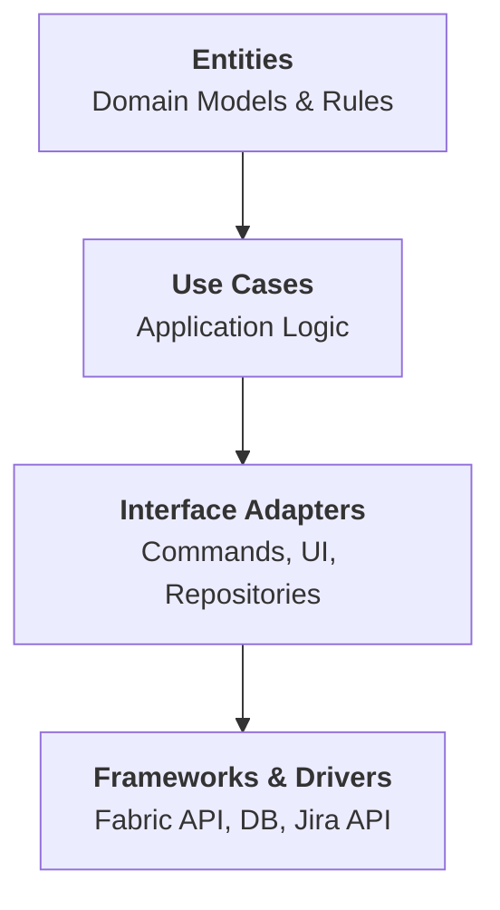

# System Architecture

## Clean Architecture Layers

MossMan follows Clean Architecture to ensure business logic remains independent of Minecraft's internals and external APIs.

### 1. Entities (`com.mossman.domain.entities`)
- **Core Models**: `Ticket`, `Project`, `User`.
- **Rules**: Business logic that is invariant (e.g., ticket state transitions).

### 2. Use Cases (`com.mossman.domain.usecases`)
- **Operations**: `CreateTicketUseCase`, `SyncProjectUseCase`.
- **Domain Event Bus**: Use Cases dispatch **Domain Events** (e.g., `TicketCreated`) to notify the system of state changes without knowing who is listening.

### 3. Interface Adapters (`com.mossman.adapters`)
- **Commands**: Fabric command handlers that call Use Cases.
- **UI**: Minecraft screens that present data from Use Cases.
- **Gateways**: Interfaces for persistence and external APIs (e.g., `TicketRepository`, `JiraGateway`).

### 4. Frameworks & Drivers (`com.mossman.infrastructure`)
- **Fabric**: The entry point and event registration.
- **Persistence**: OrmLite/SQL implementation of the `TicketRepository`.
- **External**: The actual Jira REST client.

---

## Event-Driven Flow

The system is driven by **Domain Events** emitted from Use Cases.

1. **Input**: Player runs `/mossman ticket create <parameters>`.
2. **Adapter**: `CommandAdapter` invokes `CreateTicketUseCase`.
3. **Use Case**: Performs logic, persists via `Repository`, and dispatches `TicketCreatedEvent` to the `DomainEventBus`.

### 2. Integration Example: Jira
A `moss-man-jira` mod would:
1. Register a listener for `DomainEventBus` events (e.g., `TicketUpdated`).
2. Consult its own local database/mapping to see if the MossMan Ticket ID is linked to a Jira issue.
3. Use its own `JiraGateway` to push changes to the Jira REST API.

---

## Cross-Cutting Concerns

### 1. Localization
MossMan supports multi-language support by keeping the Domain and Use Case layers language-agnostic.
- **Keys**: Use Cases return translation keys (e.g., `mossman.error.ticket_not_found`) instead of hardcoded strings.
- **Adapters**: The Command and UI adapters use Minecraft's `I18n` or `Text` components to resolve these keys using standard `lang/*.json` files.

### 2. Feature Registry (`FeatureRegistry`)
A toggle system that allows the core and extension mods to enable/disable features at runtime.
- **Interface**: The Use Case layer defines a `FeatureProvider` interface.
- **Implementation**: `FeatureRegistry` in the Infrastructure layer stores the state of these flags.
- **Registry**: Extension mods can call `FeatureRegistry.register("jira_sync", true)` to add their own toggles.

## Data Flow
1. **Trigger**: Fabric Event / Command / UI Interaction.
2. **Feature Check**: Adapter or Use Case checks the `FeatureRegistry` (via `FeatureProvider`) to see if the action is enabled.
3. **Execution**: Use Case processes logic, resolving strings to translation keys.
4. **Dispatch**: Use Case broadcasts a Domain Event.
5. **Side Effects**: Adapters reacted to the event and handle **Localization** if they need to output text to the player.
